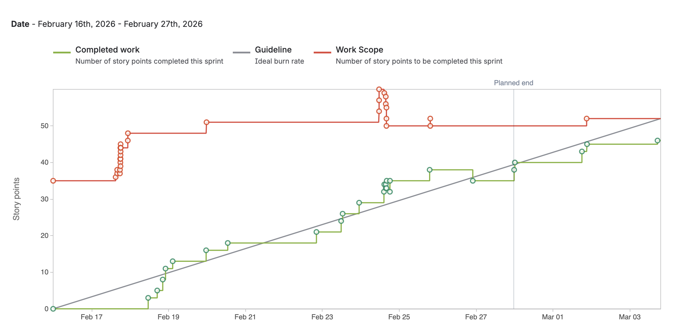
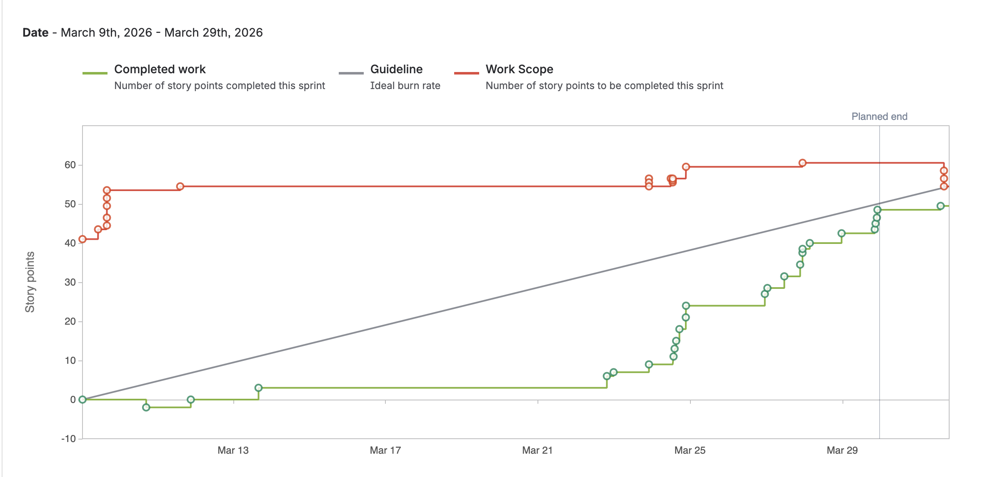
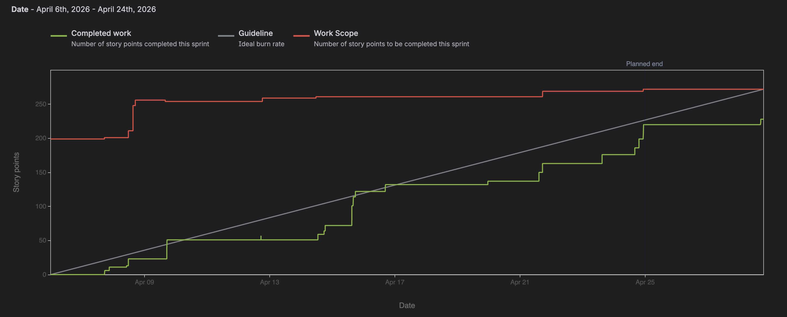

# Study-AI 
> This repo contains the front and backend code of an AI-Study tool.
> Live demo [_here_](https://www.example.com). <!-- If you have the project hosted somewhere, include the link here. -->

## Table of Contents
* [General Info](#general-information)
* [Technologies Used](#technologies-used)
* [Features](#features)
* [User Stories](#user-stories) 
* [Screenshots](#screenshots)
* [Setup](#setup)
* [Usage](#usage)
* [Project Status](#project-status)
* [Room for Improvement](#room-for-improvement)
* [Acknowledgements](#acknowledgements)
* [Contact](#contact)
<!-- * [License](#license) -->

## General Information
- Team Luna: Sumit Sah, Samuel Gonzales Pineda, Angel Ramirez, Lane Westerman, Christian Molina.
-  This is a AI-powered web app study tool designed to help students effectively study, practice key concepts, and enhance their overall learning experience through personalized and interactive tutoring.
- The change we're hoping to make with this project is provide an AI model that outputs relevant information. A "smart" AI tutor that doesn't output generalized notes off the internet, but notes seen within lectures, handwritten notes, or relevant documents. 

## Technologies Used
- React (UI)
- Open AI
- Firebase (User login)
- Python for API calls
- Vector database (Qdrant)
- Google Vision API
- Flask backend
- *Coming soon...*

## Features
Features to be implemented: 
**a**) User login (Google Authentication) 
**b**) PDF, JPG, & PNG scan & upload 
**c**) Google Vision API OCR (for handwritten notes) 
**d**) Vector database storage system 
**e**) AI generated notes 
**f**) Navbar to separate features 
**g**) Dashboard overview 
**h**) Quiz interface & progress tracker 
**i**) Adaptive quiz generation from notes 
**j**) Knowledge gap analysis 
**k**) Collaborative study room 
**l**) Personalized study plan generator 
**m**) Multi-User shared knowledge base 

## Sprint 1

### Contributions

**Sumit:** "Quiz Performance Tracking & Session Management"

- Jira Task: Sumit - [Firebase Quiz Performance]
  - [Scrum-60](https://cs3398-luna-s26.atlassian.net/jira/software/projects/SCRUM/boards/1?selectedIssue=SCRUM-60), [Bitbucket](https://bitbucket.org/cs3398-luna-s26/ai-study-tool-repository/commits/?search=SCRUM-60)

- Jira Task: Sumit - [Session Performance Tracking]
  - [Scrum-18](https://cs3398-luna-s26.atlassian.net/jira/software/projects/SCRUM/boards/1?selectedIssue=SCRUM-18), [Bitbucket](https://bitbucket.org/cs3398-luna-s26/ai-study-tool-repository/commits/?search=SCRUM-18)

**Lane:** "File Upload & PDF Processing"

- Jira Task: Lane - [React File Upload Interface]
  - [Scrum-34](https://cs3398-luna-s26.atlassian.net/browse/SCRUM-34), [Bitbucket](https://bitbucket.org/cs3398-luna-s26/ai-study-tool-repository/branch/SCRUM-34-react-file-upload-interface)

- Jira Task: Lane - [Backend File Upload API]
  - [Scrum-35](https://cs3398-luna-s26.atlassian.net/browse/SCRUM-35), [Bitbucket](https://bitbucket.org/cs3398-luna-s26/ai-study-tool-repository/branch/SCRUM-35-backend-file-upload-api)

- Jira Task: Lane - [PDF Text Extraction & Chunking]
  - [Scrum-38](https://cs3398-luna-s26.atlassian.net/browse/SCRUM-38), [Bitbucket](https://bitbucket.org/cs3398-luna-s26/ai-study-tool-repository/branch/SCRUM-38-pdf-text-extraction-chunking)

- Jira Task: Lane - [Firebase Storage Integration]
  - [Scrum-55](https://cs3398-luna-s26.atlassian.net/browse/SCRUM-55), [Bitbucket](https://bitbucket.org/cs3398-luna-s26/ai-study-tool-repository/branch/SCRUM-55-firebase-storage-integration)

**Angel:** "AI notes Generator and Navbar feature"

- Jira Task: Angel - [Build Text Input & API Integration]
  - [Scrum-28](https://cs3398-luna-s26.atlassian.net/browse/SCRUM-28), [Bitbucket](https://bitbucket.org/cs3398-luna-s26/ai-study-tool-repository/src/SCRUM-28-build-text-input-api-integratio/)

- Jira Task: Angel - [Display & Format Generated Notes]
  - [Scrum-29](https://cs3398-luna-s26.atlassian.net/browse/SCRUM-29), [Bitbucket](https://bitbucket.org/cs3398-luna-s26/ai-study-tool-repository/src/SCRUM-29-display-format-generated-notes/)

- Jira Task: Angel - [Design and Implement Navigation Bar Component]
  - [Scrum-26](https://cs3398-luna-s26.atlassian.net/browse/SCRUM-26), [Bitbucket](https://bitbucket.org/cs3398-luna-s26/ai-study-tool-repository/src/SCRUM-26-design-and-implement-navigation/)

- Jira Task: Angel - [Implementation of features on navbar for demo (not final results)]
  - [Scrum-57](https://cs3398-luna-s26.atlassian.net/browse/SCRUM-57), [Bitbucket](https://bitbucket.org/cs3398-luna-s26/ai-study-tool-repository/src/SCRUM-57-implementation-of-features-on-n/)

**Chris:** "Implemented initial dashboard, firebase storage & auth, study rooms management"

- Jira Task: Chris - [Implement Room Management Backend]
  - [Scrum-20](https://cs3398-luna-s26.atlassian.net/jira/software/projects/SCRUM/boards/1?selectedIssue=SCRUM-20), [Bitbucket](https://bitbucket.org/cs3398-luna-s26/ai-study-tool-repository/branch/SCRUM-20-room-management-backend)

- Jira Task: Chris - [Prompt User Login]
  - [Scrum-56](https://cs3398-luna-s26.atlassian.net/jira/software/projects/SCRUM/boards/1?selectedIssue=SCRUM-56), [Bitbucket](https://bitbucket.org/cs3398-luna-s26/ai-study-tool-repository/branch/SCRUM-56-create-user-login-ui)

- Jira Task: Chris - [Firestore Schema Design & Initialization]
  - [Scrum-53](https://cs3398-luna-s26.atlassian.net/jira/software/projects/SCRUM/boards/1?selectedIssue=SCRUM-53), [Bitbucket](https://bitbucket.org/cs3398-luna-s26/ai-study-tool-repository/branch/SCRUM-53-firestore-schema-design-initial)

- Jira Task: Chris - [Security Rules & End-to-End Connection Verification]
  - [Scrum-54](https://cs3398-luna-s26.atlassian.net/jira/software/projects/SCRUM/boards/1?selectedIssue=SCRUM-54), [Bitbucket](https://bitbucket.org/cs3398-luna-s26/ai-study-tool-repository/branch/SCRUM-54-security-rules-and-connection-verif)

- Jira Task: Chris - [Firebase Project Setup & Team Configuration]
  - [Scrum-51](https://cs3398-luna-s26.atlassian.net/jira/software/projects/SCRUM/boards/1?selectedIssue=SCRUM-51), [Bitbucket](https://bitbucket.org/cs3398-luna-s26/ai-study-tool-repository/branch/SCRUM-51-implement-webapp-database)

- Jira Task: Chris - [Design the Collaborative Study Room Interface]
  - [Scrum-19](https://cs3398-luna-s26.atlassian.net/jira/software/projects/SCRUM/boards/1?selectedIssue=SCRUM-19), [Bitbucket](https://bitbucket.org/cs3398-luna-s26/ai-study-tool-repository/branch/SCRUM-19-design-collaborative-board-interface)

- Jira Task: Chris - [Design the Dashboard Layout]
  - [Scrum-22](https://cs3398-luna-s26.atlassian.net/jira/software/projects/SCRUM/boards/1?selectedIssue=SCRUM-22), [Bitbucket](https://bitbucket.org/cs3398-luna-s26/ai-study-tool-repository/branch/SCRUM-22-design-the-dashboard-layout)

**Sam:** "Implemented the Quiz Generation service"

- Jira Task: Sam - [Generate context based on notes]
  - [Scrum-12](https://cs3398-luna-s26.atlassian.net/jira/software/projects/SCRUM/boards/1?selectedIssue=SCRUM-12), [Bitbucket](https://bitbucket.org/cs3398-luna-s26/ai-study-tool-repository/commits/branch/SCRUM-12-generate-score-quiz-openai-pyth)

- Jira Task: Sam - [Generate Quiz options (JSON)]
  - [Scrum-44](https://cs3398-luna-s26.atlassian.net/jira/software/projects/SCRUM/boards/1?selectedIssue=SCRUM-44), [Bitbucket](https://bitbucket.org/cs3398-luna-s26/ai-study-tool-repository/commits/branch/SCRUM-44-generate-quiz-options-json)

- Jira Task: Sam - [Quiz logic / prep for React Integration]
  - [Scrum-45](https://cs3398-luna-s26.atlassian.net/jira/software/projects/SCRUM/boards/1?selectedIssue=SCRUM-45), [Bitbucket](https://bitbucket.org/cs3398-luna-s26/ai-study-tool-repository/commits/branch/SCRUM-45-quiz-logic-react-integration)

- Jira Task: Sam - [Desing Quiz Screen (React)]
  - [Scrum-11](https://cs3398-luna-s26.atlassian.net/jira/software/projects/SCRUM/boards/1?selectedIssue=SCRUM-11), [Bitbucket](https://bitbucket.org/cs3398-luna-s26/ai-study-tool-repository/commits/branch/SCRUM-11-design-quiz-screen-react)

## Report

## Sprint 2

### Contributions

**Sumit:** "Quiz History API, Trend Analysis & Firestore Verification"

- Jira Task: Sumit - [Develop Quiz History Retrieval API]
  - [SCRUM-88](https://cs3398-luna-s26.atlassian.net/browse/SCRUM-88), [Bitbucket](https://bitbucket.org/cs3398-luna-s26/ai-study-tool-repository/commits/?search=SCRUM-88)

- Jira Task: Sumit - [Implement Trend Analysis and Progress Charts for Quiz Attempt History]
  - [SCRUM-90](https://cs3398-luna-s26.atlassian.net/browse/SCRUM-90), [Bitbucket](https://bitbucket.org/cs3398-luna-s26/ai-study-tool-repository/commits/?search=SCRUM-90)

- Jira Task: Sumit - [Verify Firebase Collections Visibility in Firestore UI]
  - [SCRUM-89](https://cs3398-luna-s26.atlassian.net/browse/SCRUM-89), [Bitbucket](https://bitbucket.org/cs3398-luna-s26/ai-study-tool-repository/commits/?search=SCRUM-89)

**Lane:** "Started and finished implementing the OCR image processing & handling, finishing off the file-upload backend altogether."

- Jira Task: Lane - [Embedding Generation & Qdrant Storage]
  - [Scrum-39](https://cs3398-luna-s26.atlassian.net/jira/software/projects/SCRUM/boards/1?selectedIssue=SCRUM-39), [Bitbucket](https://bitbucket.org/cs3398-luna-s26/ai-study-tool-repository/commits/?search=SCRUM-39)

- Jira Task: Lane - [Processing Error Handling]
  - [Scrum-40](https://cs3398-luna-s26.atlassian.net/jira/software/projects/SCRUM/boards/1?selectedIssue=SCRUM-40), [Bitbucket](https://bitbucket.org/cs3398-luna-s26/ai-study-tool-repository/commits/?search=SCRUM-40)

- Jira Task: Lane - [OCR Integration]
  - [Scrum-36](https://cs3398-luna-s26.atlassian.net/jira/software/projects/SCRUM/boards/1?selectedIssue=SCRUM-36), [Bitbucket](https://bitbucket.org/cs3398-luna-s26/ai-study-tool-repository/commits/?search=SCRUM-36)

- Jira Task: Lane - [Editable Text Review UI]
  - [Scrum-37](https://cs3398-luna-s26.atlassian.net/jira/software/projects/SCRUM/boards/1?selectedIssue=SCRUM-37), [Bitbucket](https://bitbucket.org/cs3398-luna-s26/ai-study-tool-repository/commits/?search=SCRUM-37)

- Jira Task: Lane - [Embedding Creation from Edited Text]
  - [Scrum-41](https://cs3398-luna-s26.atlassian.net/jira/software/projects/SCRUM/boards/1?selectedIssue=SCRUM-41), [Bitbucket](https://bitbucket.org/cs3398-luna-s26/ai-study-tool-repository/commits/?search=SCRUM-41)

  

**Angel:** "To be added"

- Jira Task: Angel - [Task Name]
  - [Scrum-XX](https://cs3398-luna-s26.atlassian.net/jira/software/projects/SCRUM/boards/1?selectedIssue=SCRUM-XX), [Bitbucket](https://bitbucket.org/cs3398-luna-s26/ai-study-tool-repository/commits/?search=SCRUM-XX)

**Chris:** "Implemented Study Rooms using previous shema and current Dashboard UI"

- Jira Task: Chris - [Build RoomsPage with Firestore-Wired Room Cards]
  - [Scrum-68](https://cs3398-luna-s26.atlassian.net/jira/software/projects/SCRUM/boards/1?selectedIssue=SCRUM-68), [Bitbucket](https://bitbucket.org/cs3398-luna-s26/ai-study-tool-repository/branch/SCRUM-68-build-roomspage-w-firestore-rooms)

- Jira Task: Chris - [Build Dashboard Welcome Banner Component]
  - [Scrum-79](https://cs3398-luna-s26.atlassian.net/jira/software/projects/SCRUM/boards/1?selectedIssue=SCRUM-79), [Bitbucket](https://bitbucket.org/cs3398-luna-s26/ai-study-tool-repository/branch/SCRUM-79-build-dashboard-welcome-banner)

- Jira Task: Chris - [Build Stats Row with Real Firestore Counts]
  - [Scrum-80](https://cs3398-luna-s26.atlassian.net/jira/software/projects/SCRUM/boards/1?selectedIssue=SCRUM-80), [Bitbucket](https://bitbucket.org/cs3398-luna-s26/ai-study-tool-repository/branch/SCRUM-80-build-stats-row-with--firestore-counts)

- Jira Task: Chris - [Build Recent Activity Section with Empty State]
  - [Scrum-81](https://cs3398-luna-s26.atlassian.net/jira/software/projects/SCRUM/boards/1?selectedIssue=SCRUM-81), [Bitbucket](https://bitbucket.org/cs3398-luna-s26/ai-study-tool-repository/branch/SCRUM-81-build-recent-activity-section)

- Jira Task: Chris - [AI-Generated Daily Study Brief]
  - [Scrum-82](https://cs3398-luna-s26.atlassian.net/jira/software/projects/SCRUM/boards/1?selectedIssue=SCRUM-82), [Bitbucket](https://bitbucket.org/cs3398-luna-s26/ai-study-tool-repository/branch/SCRUM-82-ai-generated-daily-study-brief)

**Sam:** "Improved Quiz Generation pipeline and user onboarding"

- Jira Task: Sam - [Quiz Analysis + Logic]
  - [Scrum-63](https://cs3398-luna-s26.atlassian.net/jira/software/projects/SCRUM/boards/1?selectedIssue=SCRUM-63), [Bitbucket](https://bitbucket.org/cs3398-luna-s26/ai-study-tool-repository/commits/?search=SCRUM-63)

- Jira Task: Sam - [Improved Login Page]
  - [Scrum-83](https://cs3398-luna-s26.atlassian.net/jira/software/projects/SCRUM/boards/1?selectedIssue=SCRUM-83), [Bitbucket](https://bitbucket.org/cs3398-luna-s26/ai-study-tool-repository/commits/?search=SCRUM-83)

- Jira Task: Sam - [Entry for PDF + Images Implementation for Quizzes]
  - [Scrum-69](https://cs3398-luna-s26.atlassian.net/jira/software/projects/SCRUM/boards/1?selectedIssue=SCRUM-69), [Bitbucket](https://bitbucket.org/cs3398-luna-s26/ai-study-tool-repository/commits/?search=SCRUM-69)

- Jira Task: Sam - [Prompt the User to Gather Personal Info]
  - [Scrum-74](https://cs3398-luna-s26.atlassian.net/jira/software/projects/SCRUM/boards/1?selectedIssue=SCRUM-74), [Bitbucket](https://bitbucket.org/cs3398-luna-s26/ai-study-tool-repository/commits/?search=SCRUM-74)

- Jira Task: Sam - [Quiz Quality Assurance]
  - [Scrum-65](https://cs3398-luna-s26.atlassian.net/jira/software/projects/SCRUM/boards/1?selectedIssue=SCRUM-65), [Bitbucket](https://bitbucket.org/cs3398-luna-s26/ai-study-tool-repository/commits/?search=SCRUM-65)

## Report

## Sprint 3

### Contributions

**Sumit:** "Short summary of what was accomplished"

- Jira Task: Sumit - [Task Name]
  - [SCRUM-#](https://cs3398-luna-s26.atlassian.net/jira/software/projects/SCRUM/boards/1?selectedIssue=SCRUM-#), [Bitbucket](https://bitbucket.org/cs3398-luna-s26/ai-study-tool-repository/commits/?search=SCRUM-#)

**Lane:** "Started and finished implementing the OCR image processing & handling, finishing off the file-upload backend altogether."

- Jira Task: Lane - [Embedding Generation & Qdrant Storage]
  - [Scrum-39](https://cs3398-luna-s26.atlassian.net/jira/software/projects/SCRUM/boards/1?selectedIssue=SCRUM-39), [Bitbucket](https://bitbucket.org/cs3398-luna-s26/ai-study-tool-repository/commits/?search=SCRUM-39)

- Jira Task: Lane - [Processing Error Handling]
  - [Scrum-40](https://cs3398-luna-s26.atlassian.net/jira/software/projects/SCRUM/boards/1?selectedIssue=SCRUM-40), [Bitbucket](https://bitbucket.org/cs3398-luna-s26/ai-study-tool-repository/commits/?search=SCRUM-40)

- Jira Task: Lane - [OCR Integration]
  - [Scrum-36](https://cs3398-luna-s26.atlassian.net/jira/software/projects/SCRUM/boards/1?selectedIssue=SCRUM-36), [Bitbucket](https://bitbucket.org/cs3398-luna-s26/ai-study-tool-repository/commits/?search=SCRUM-36)

- Jira Task: Lane - [Editable Text Review UI]
  - [Scrum-37](https://cs3398-luna-s26.atlassian.net/jira/software/projects/SCRUM/boards/1?selectedIssue=SCRUM-37), [Bitbucket](https://bitbucket.org/cs3398-luna-s26/ai-study-tool-repository/commits/?search=SCRUM-37)

- Jira Task: Lane - [Embedding Creation from Edited Text]
  - [Scrum-41](https://cs3398-luna-s26.atlassian.net/jira/software/projects/SCRUM/boards/1?selectedIssue=SCRUM-41), [Bitbucket](https://bitbucket.org/cs3398-luna-s26/ai-study-tool-repository/commits/?search=SCRUM-41)

  
**Angel:** "To be added"

- Jira Task: Angel - [Task Name]
  - [Scrum-XX](https://cs3398-luna-s26.atlassian.net/jira/software/projects/SCRUM/boards/1?selectedIssue=SCRUM-XX), [Bitbucket](https://bitbucket.org/cs3398-luna-s26/ai-study-tool-repository/commits/?search=SCRUM-XX)

**Chris:** "Finished study room invite/join flow. Researched and Deployed our application"

- Jira Task: Chris - [Implement Create Room and Invite Code Join Flow]
  - [SCRUM-71](https://cs3398-luna-s26.atlassian.net/jira/software/projects/SCRUM/boards/1?selectedIssue=SCRUM-71), [Bitbucket](https://bitbucket.org/cs3398-luna-s26/ai-study-tool-repository/branch/SCRUM-71-implement-create-room-and-invite-link)

- Jira Task: Chris - [Configure DigitalOcean App Platform Project]
  - [SCRUM-99](https://cs3398-luna-s26.atlassian.net/jira/software/projects/SCRUM/boards/1?selectedIssue=SCRUM-99), [Bitbucket](https://bitbucket.org/cs3398-luna-s26/ai-study-tool-repository/branch/SCRUM-99-configure-digitalocean-app)

Jira Task: Chris - Remaining tasks were completed off-codebase. Initially configuring Digital Ocean, afterwards migrating using Google cloud run and Firebase hosting. SCRUM-99 task commits were overscoped. 

**Sam:** "Short summary of what was accomplished"

- Jira Task: Sumit - [Task Name]
  - [SCRUM-#](https://cs3398-luna-s26.atlassian.net/jira/software/projects/SCRUM/boards/1?selectedIssue=SCRUM-#), [Bitbucket](https://bitbucket.org/cs3398-luna-s26/ai-study-tool-repository/commits/?search=SCRUM-#)

## Report

## Next Steps

**Sumit:**
- Next step

- Next step

**Lane:**
- Next step

- Next step

**Angel:**
- Next step

- Next step

**Chris:**
- Continue working on this application, potentially turning it into a huge commodity for academic students or busy professionals alike. 

**Sam:**
- Next step

- Next step

## User Stories
- **AI Knowledge Gap Analysis:** As a student, I would like the system to analyze my quiz performance and study activity so that I can identify my weak topics and improve efficiently. *(i, j)*

- **Introductory Dashboard:** As a student, I would like to see a clean introductory dashboard upon logging in that gives me an overview of my uploaded documents and quick access to all study tools, so that I can easily navigate to the feature I need and stay organized across my study sessions. *(a, f, g)*

- **Navigation Bar:** As a student, I would like a navigation bar so that I can easily switch between features. *(f)*

- **File Upload & PDF Processing:** As a student, I would like to upload my lecture slides (PDF) or images of handwritten notes so that I can use my own class materials within the AI tutor and have them processed into the study database. *(b, c)*

- **OCR & Image-to-Vector:** As a student, I would like my uploaded handwritten notes (images) to be converted into readable text and stored in the AI retrieval system so that the AI can analyze and use them for studying. *(c, b, d)*

- **Quiz Generator:** As a student, I would like quizzes generated from my notes so that I can test my understanding. *(i)*

- **Summary Notes Generation:** As a student, I would like AI-generated summarized notes so that I can quickly review important concepts. *(e)*

- **Quiz Layout:** As a student, I would like a screen to effectively see the quiz layout so that I can clearly read questions, select answers, and track my progress. *(h)*

- **Collaborative Study Room:** As a student in a study group, I want to create a shared room where my teammates can upload their own notes and we all interact with the same Al tutor, so that we can pool our materials and quiz each other on a combined knowledge base. *(k, m)*

- **Personalized Study Plan Generator:** As a student, I would like the system to generate a personalized study schedule based on my upcoming exams and weak topics so that I can manage my time effectively. *(l, j)*

- **Webapp Deployment:** As a student user, I want the AiTutor webapp to be accessible via a public URL so that I can study from any device without needing to run the app locally.

## Screenshots

## Setup
1) Install Node.js (verify install: 'node -v'): https://nodejs.org/en/download
2) Install Node.js dependencies (package.json): 'npm install'
3) Go to backend directory: 'cd backend/'
4) Start venv: 'source venv/bin/activate'
5) Install Python dependencies (requirements.txt): 'pip3 install -r requirements.txt'
6) Run backned locally: 'python3 app.py'
6) Run React app frontent locally (using Vite) from main project directory in seperate terminal: 'npm run dev'

## Usage
To be determined

`write-your-code-here`

## Project Status
Project is: _in progress_ 

<!-- /_complete_ / _no longer being worked on_. If you are no longer working on it, provide reasons why.-->

## Acknowledgements
Give credit here.
- This project was inspired by [Assignment 3: Building your own AI Assistant](https://bitbucket.org/txstatecs3398all/assignment-build-your-own-ai-assistant-main/src/main/).

## Contact
LW: ers151@txstate.edu
CM: kgy5@txstate.edu