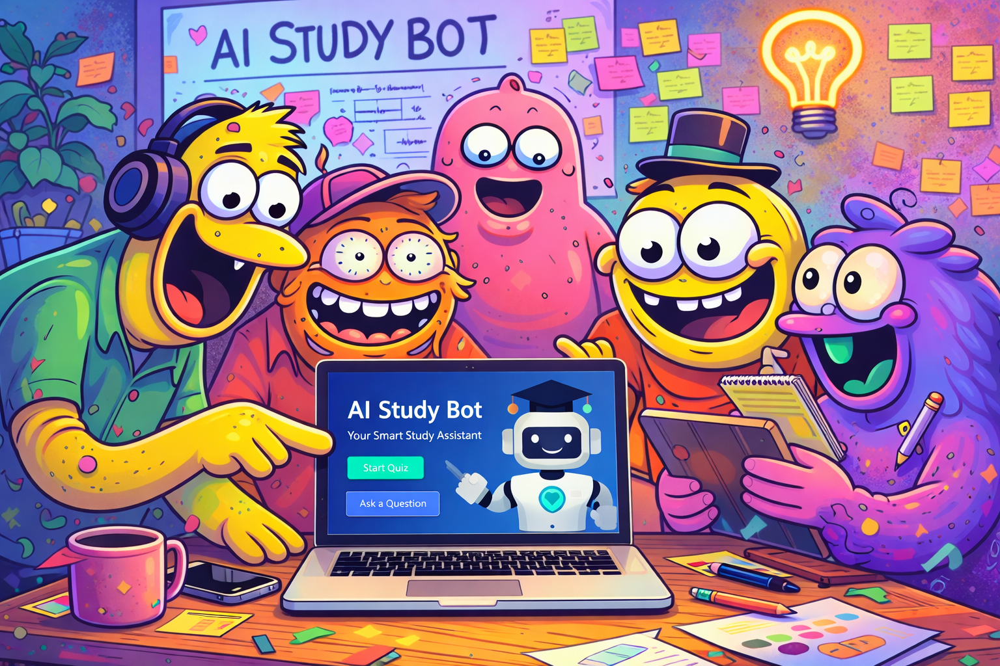

# Study-AI 
> This repo contains the front and backend code of an AI-Study tool.
> Live demo [_here_](https://www.example.com). <!-- If you have the project hosted somewhere, include the link here. -->

## Table of Contents
* [General Info](#general-information)
* [Technologies Used](#technologies-used)
* [Features](#features)
* [User Stories](#user-stories) 
* [Screenshots](#screenshots)
* [Setup](#setup)
* [Usage](#usage)
* [Project Status](#project-status)
* [Room for Improvement](#room-for-improvement)
* [Acknowledgements](#acknowledgements)
* [Contact](#contact)
<!-- * [License](#license) -->

## General Information
- Team Luna: Sumit Sah, Samuel Gonzales Pineda, Angel Ramirez, Lane Westerman, Christian Molina.
-  This is a AI-powered web app study tool designed to help students effectively study, practice key concepts, and enhance their overall learning experience through personalized and interactive tutoring.
- The change we're hoping to make with this project is provide an AI model that outputs relevant information. A "smart" AI tutor that doesn't output generalized notes off the internet, but notes seen within lectures, handwritten notes, or relevant documents. 

## Technologies Used
- React (UI)
- Open AI
- Firebase (User login)
- Python for API calls
- Vector Database (Qdrant)
- Google Vision API
- *Coming soon...*

## Features
Features to be implemented: 
**a**) User login (Google Authentication) 
**b**) PDF, JPG, & PNG scan & upload 
**c**) Google Vision API OCR (for handwritten notes) 
**d**) Vector database storage system 
**e**) AI generated notes 
**f**) Navbar to separate features 
**g**) Dashboard overview 
**h**) Quiz interface & progress tracker 
**i**) Adaptive quiz generation from notes 
**j**) Knowledge gap analysis 
**k**) Collaborative study room 
**l**) Personalized study plan generator 
**m**) Multi-User shared knowledge base 

## User Stories
- **AI Knowledge Gap Analysis:** As a student, I would like the system to analyze my quiz performance and study activity so that I can identify my weak topics and improve efficiently. *(i, j)*

- **Introductory Dashboard:** As a student, I would like to see a clean introductory dashboard upon logging in that gives me an overview of my uploaded documents and quick access to all study tools, so that I can easily navigate to the feature I need and stay organized across my study sessions. *(a, f, g)*

- **Navigation Bar:** As a student, I would like a navigation bar so that I can easily switch between features. *(f)*

- **File Upload & PDF Processing:** As a student, I would like to upload my lecture slides (PDF) or images of handwritten notes so that I can use my own class materials within the AI tutor and have them processed into the study database. *(b, c)*

- **OCR & Image-to-Vector:** As a student, I would like my uploaded handwritten notes (images) to be converted into readable text and stored in the AI retrieval system so that the AI can analyze and use them for studying. *(c, b, d)*

- **Quiz Generator:** As a student, I would like quizzes generated from my notes so that I can test my understanding. *(i)*

- **Summary Notes Generation:** As a student, I would like AI-generated summarized notes so that I can quickly review important concepts. *(e)*

- **Quiz Layout:** As a student, I would like a screen to effectively see the quiz layout so that I can clearly read questions, select answers, and track my progress. *(h)*

- **Collaborative Study Room:** As a student in a study group, I want to create a shared room where my teammates can upload their own notes and we all interact with the same Al tutor, so that we can pool our materials and quiz each other on a combined knowledge base. *(k, m)*

- **Personalized Study Plan Generator:** As a student, I would like the system to generate a personalized study schedule based on my upcoming exams and weak topics so that I can manage my time effectively. *(l, j)*

## Screenshots

## Setup
Install the requirements.txt (To be determined)

## Usage
To be determined

`write-your-code-here`

## Project Status
Project is: _in progress_ 

<!-- /_complete_ / _no longer being worked on_. If you are no longer working on it, provide reasons why.-->

## Room for Improvement

To be added 
<!-- 
To be determined

Room for improvement:
- Improvement to be done 1
- Improvement to be done 2

To do:
- Feature to be added 1
- Feature to be added 2
-->

## Acknowledgements
Give credit here.
- This project was inspired by [Assignment 3: Building your own AI Assistant](https://bitbucket.org/txstatecs3398all/assignment-build-your-own-ai-assistant-main/src/main/).

## Contact
LW: ers151@txstate.edu